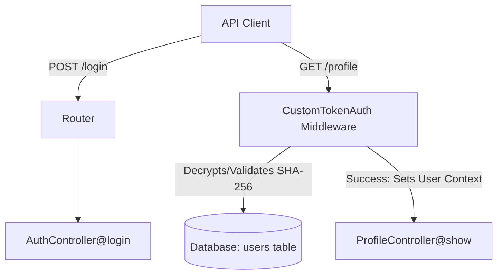

# Project Handover Documentation — custom-auth

This document serves as the architectural overview and handover log for future AI agents and developers working on this codebase.

## 🏗️ Architecture & Core Components

This package (`arth2o/auth-profile`) is a lightweight, self-contained token-based authentication package built using modern Laravel 13 features and PHP 8.3 practices.

### 1. Database Schema
The package extends the host application's `users` table via an anonymous migration stub:
*   `api_token` (64-char string, unique, indexed, nullable): Stores the SHA-256 hash of the bearer token.
*   `expires_at` (timestamp, nullable): Stores the calculated token expiration timestamp.

### 2. Auth Flow
1.  **Login**: `AuthController` validates request data via `LoginRequest`, verifies the password hash using `Hash::check`, generates an 80-character cryptographically secure token via `Str::random`, hashes it using SHA-256, stores the hash and `expires_at` in the database, and returns the plaintext token to the client.
2.  **Authorization**: `CustomTokenAuth` middleware extracts the Bearer token, hashes it, checks it against the database, rejects if expired (and clears the expired record), and logs the user in for the current request using `auth()->setUser($user)`.

---

## 📍 Current Project Status

- [x] Base Package & Composer Setup
- [x] Spatie Laravel Package Tools Integration
- [x] Migrations & Schema Extensions
- [x] Login Form Request & Validation
- [x] Secure Controller Logic (Prevent User-Enumeration, Sanctum-Style Hashing)
- [x] Rate Throttling Middleware (`throttle:5,1`)
- [x] Profile Controller (Response Sanitization)
- [x] Full Test Coverage (Pest + Orchestra Testbench)
- [x] Clean .gitignore & Public API Documentation

---

## 🚀 How to Continue the Project

Here are the immediate roadmap priorities and technical instructions for extending the package:

### 1. Implement Token Revocation (`POST /logout`)
*   **Goal**: Allow users to invalidate their active token.
*   **Implementation**:
    1. Add `Route::post('/logout', [AuthController::class, 'logout'])->middleware('custom-token-auth')` to `routes/api.php`.
    2. In `AuthController@logout`, retrieve the authenticated user: `auth()->user()->update(['api_token' => null, 'expires_at' => null])`.
    3. Add Pest feature tests verifying logout invalidates the token.

### 2. Implement Multi-Token Support (Optional)
*   **Goal**: Allow a user to log in from multiple devices without revoking previous sessions.
*   **Implementation**:
    *   Transition from storing `api_token` on the `users` table directly to a separate `custom_access_tokens` table (polymorphic relationship, similar to Laravel Sanctum).

### 3. Add Token Cleanup Command
*   **Goal**: Periodically delete expired tokens from the database.
*   **Implementation**:
    *   Create a console command `AuthProfile\Console\Commands\PurgeExpiredTokens`.
    *   Query: `$userModel::whereNotNull('expires_at')->where('expires_at', '<', now())->update(['api_token' => null, 'expires_at' => null]);`.

### 4. Custom Route Prefix Configurations
*   **Goal**: Allow host applications to customize the `/api/custom-auth` prefix.
*   **Implementation**:
    *   Add `route_prefix` setting in `config/auth-profile.php`.
    *   Update route registration in `routes/api.php` to read the config prefix.
